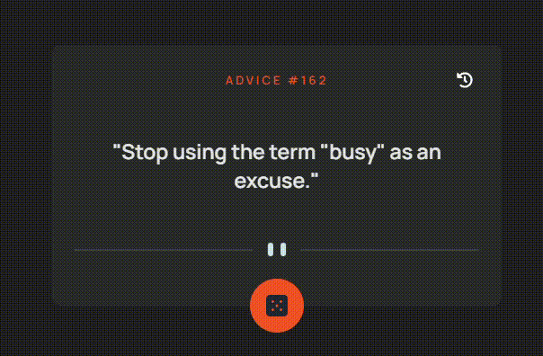

# 🎲 Advice Generator App  

---

## 🚀 Sobre el proyecto
Este proyecto marca **mi regreso a la programación web** después de un tiempo alejado del código.  
La idea fue empezar con algo simple pero completo: consumir una API, manejar estados en React, practicar CSS responsivo y agregar funcionalidades extras como un **historial de consejos**.  

Para mí representa un **nuevo inicio** 💪, un espacio para recordar, mejorar y volver a tomar ritmo en el desarrollo frontend.  

---

## 🎯 Funcionalidades
- 🔄 Generar consejos aleatorios desde la API [Advice Slip](https://api.adviceslip.com/).
- 🧭 Historial de consejos, con diseño minimalista y moderno.
- 🎨 Estilos con **CSS Modules** y animaciones sutiles.
- 📱 Diseño **responsive** (mobile-first).

---

## 🛠️ Tecnologías utilizadas
- ⚛️ React 18
- 🎨 CSS Modules
- 🌐 Fetch API

---

## 📸 Vista previa
**

---

## 📌 Próximos pasos
- 🔍 Mejorar la accesibilidad (a11y).
- 🌙 Dark/Light theme switch.
- 📱 Mejorar animaciones y microinteracciones.
- 💾 Posibilidad de guardar historial en `localStorage`.

---

## 🤝 Contribuciones
Toda sugerencia es bienvenida 🙌.  
Podés abrir un issue o dejar un comentario para mejorar la app.  

---

## 📬 Contacto
- GitHub: [@ezexgonzalez](https://github.com/ezexgonzalez)